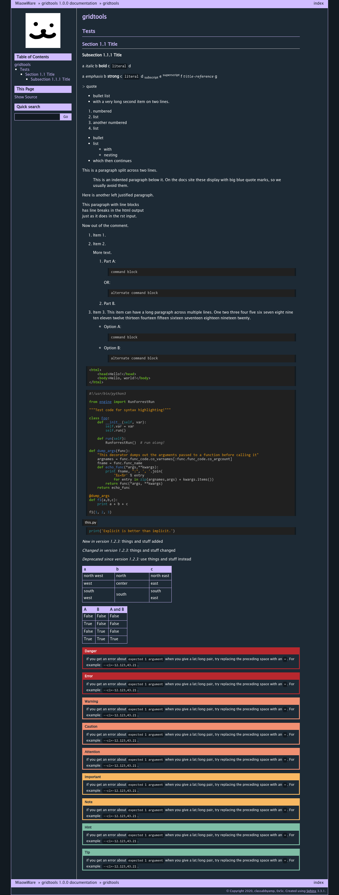

# Miaowware Sphinx Theme

This theme is used for sphinx documentation of Miaowware projects.

## Usage

Install with `pip install -e https://github.com/miaowware/miaowware-sphinx-theme.git`,
or add `-e https://github.com/miaowware/miaowware-sphinx-theme.git` to your sphinx `requirements.txt`.

In your sphinx `conf.py`, add:

```py
import miaowware_sphinx_theme

# ...

html_theme = "miaowware"
html_theme_path = miaowware_sphinx_theme.get_html_theme_path()

# If you want a logo
html_logo = "_static/your_logo.png"
```

## Copyright

Copyright 2020 classabbyamp, 0x5c  
Released under the BSD 3-Clause License.  
See [`LICENSE`](LICENSE) for the full license text.

## Screenshots


